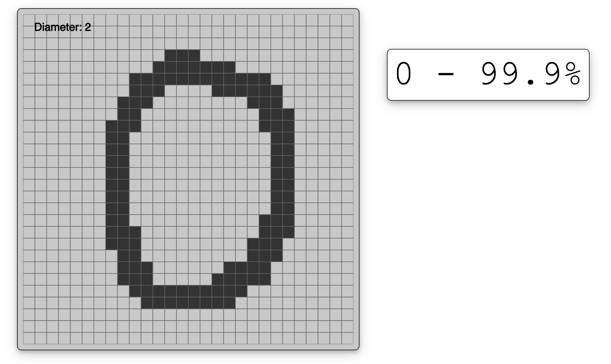

# MNIST Numbers Interface

## An interactive example of a neural network in action!

Made with Tensorflow 2.0 and p5.js

Trained on the MNIST hand-drawn number dataset.

## Usage

Draw a number, any number! (As long as it's between 0-9). Draw by clicking on the canvas and dragging your cursor. **Up and down arrows** control the size of the "brush". **Space** clears the screen, and **Enter** will send off your drawing to be predicted by the model.

## How It Works
A neural network model was pretrained in `model.py` using data from the MNIST dataset and saved to the `saved_model` directory.

The main server script is `app.py`, which opens the saved model on startup, serves the p5 canvas/frontend, and returns predictions of the image that are requested in from `script.js`.

`script.js` stores floating-point values of 1.0 or 0.0 in a 2D array of 28x28, equivalent dimensions to each image in the MNIST training set. Clicking on a displayed pixel will update its value in the array. When Enter is pressed to submit the drawing, the array is JSON stringified and sent via a XHttp POST request back to server, routed to `/submit`. 

On the server side, the request is parsed as JSON and converted into a Numpy array so it can be interpreted by the model. For some reason, this array has to be transposed for the model to read it correctly. I'm assuming this has to do with how the images in the training set are formatted, but it could be a result of how Javascript unpacks 2D arrays when calling the `.toString()` method, which is done before the request is made to the server.

Once the server responds with the predicted digit and how "sure" it is (just the value of the highest neuron in the softmax layer), the `XHttp.onreadystatechange()` method is executed, and the DOM is updated with the appropiate values.

## Notes

I've found it to be bad at some numbers, like 7, and good at others, like 0 and 3. And from my experience, using a diameter of 2 or 3 yields the best results.

Experiment, try different ways to write digits, different handwriting, and different sizes!